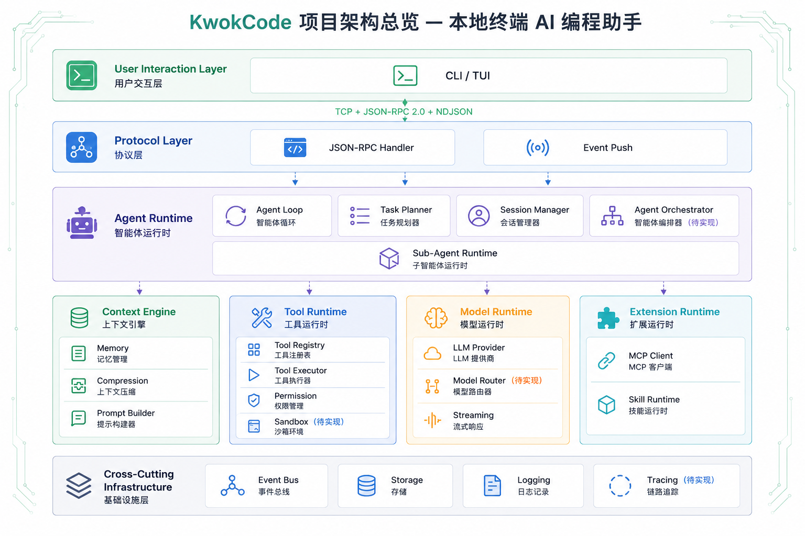
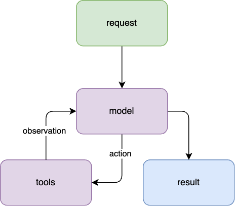
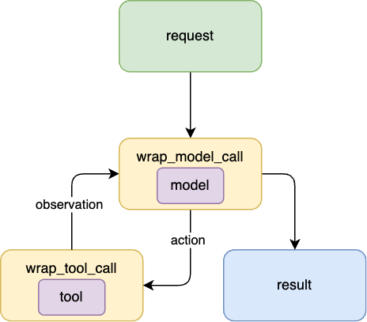

# KwokCode

> 本地终端 AI 编程助手｜自研 Skill 系统｜JSON-RPC 守护进程架构

类似 Claude Code，完全本地实现，用于在终端完成代码阅读、修改、调试、项目重构。

## ✨ 特性

- 🖥️ 终端交互式会话，流式大模型输出 + 思考过程（reasoning）实时展示
- 🧩 Skill 技能系统：可扩展自定义技能，隔离工具白名单
- 🤖 Sub-agent 协作：spawn_agent 派生隔离子代理，Planner / Reviewer / Implementer 内置角色，支持后台任务
- 🔌 MCP 接入：外部 MCP 服务端工具注入为普通工具
- 🛡️ 工具管控：Bash 黑名单、文件读写保护、权限审批链
- 📝 会话持久化：会话记录、项目级记忆、会话级记忆
- ⚙️ 层级配置：~/.kwok/setting.json → .env → 环境变量
- 📡 TCP JSON-RPC 2.0 服务端/客户端分离架构（daemon 后台常驻）
- 📜 NDJSON 结构化日志，区分控制台人类可读格式 / JSON 机器格式

## 架构设计


## 代理循环


当您给 KwokCode 一个任务，它会进入一个代理循环：收集上下文 → 采取行动 → 验证结果 → 重复，直到完成。

您的提示经 kwok 入口、TCP + JSON-RPC 送到常驻 daemon。服务端的 Agent Loop 把输入、会话历史、项目记忆和压缩摘要组装成上下文，交给 LLM 流式生成。模型推理，工具行动——读文件、跑 Bash、改代码，每次调用都穿过权限审批、参数校验、事件广播的切面，结果回填上下文，供下一步决策。

循环按任务自适应：问代码只需一次收集，修 Bug 会反复穿越，重构涉及大范围验证。工具结果被压缩截断回填，模型基于前一步所学链式执行并沿途纠正。

您随时可以中断引导。面对复杂任务，它会用 spawn_agent 派生隔离子代理（Planner/Reviewer/Implementer）分工执行，或通过 /skill 斜杠命令收缩工具范围完成专项任务。安全是一条贯穿全局的约束线：Bash 黑名单、写前必读、敏感操作走审批。
## 快速开始

```bash
# 安装依赖（项目用 uv 管理）
uv sync

# 首次：后台启动守护进程
uv run kwok server start

# 进入交互式会话
uv run kwok

# 或直接提问
uv run kwok prompt "解释一下 src/kwok/server/session/manager.py 的架构"
```

## 命令行使用

### 交互式会话（TUI，默认）

```bash
kwok
```

### interactive 文本交互

```bash
kwok interactive
```

无 TUI 依赖的纯文本交互模式（`input()` 逐行），适合脚本/极简终端。

### prompt 单次提问

```bash
kwok prompt "你的问题"
```

直接发起 chat，流式输出大模型回复后退出。

### ping / version 运维命令

```bash
kwok ping        # 测试服务端连通性
kwok version     # 打印服务端版本号
```

### server 守护进程管理

```bash
kwok server start    # 后台启动 kwok-server
kwok server stop     # 停止运行中的守护进程
kwok server status   # 查看运行状态
kwok server restart  # 重启守护进程
```

守护进程使用 PID 文件（`~/.kwok/kwok-server-{port}.pid`）管理生命周期，端口级隔离。

## Skill 技能系统

Skill 是面向用户的"命令式"能力封装层：用户输入 `/skill_name <args>` 触发 → 解析 Markdown 模板 → 同时产出系统提示覆盖和工具白名单两个维度，下传给一次 run。

### Skill 文件格式规范

每个 Skill 是一个 `<name>/SKILL.md` 目录，文件结构为 YAML frontmatter + Markdown 正文：

```markdown
---
name: review
description: 审查指定文件或目录的代码质量
allowed_tools:
  - read_file
  - grep
---
请对以下代码区域做一次代码审查：$ARGUMENTS

重点检查：
- 正确性：是否存在明显 bug、边界处理缺失
- 可读性：命名、结构、职责是否清晰
- 安全性：是否引入安全隐患
```

- `name`：Skill 名称（必填，缺失则视为非法 Skill）
- `description`：简要描述（弹层候选展示用）
- `allowed_tools`：工具白名单（可选，空则不设限）
- `$ARGUMENTS`：占位符，运行时替换为用户实参
- 正文：作为 system prompt 覆盖默认提示词

### 加载优先级：本地项目 → 用户全局 → 内置

```
1. .kwok/skills/          # 项目本地（最高优先）
2. ~/.kwok/skills/        # 用户全局
3. 内置 prebuilt/         # 兜底
```

同名 Skill 本地版本覆盖全局与内置。

### 编写自定义 Skill

在项目根目录创建 `.kwok/skills/<name>/SKILL.md`：

```bash
mkdir -p .kwok/skills/my-skill
cat > .kwok/skills/my-skill/SKILL.md << 'EOF'
---
name: my-skill
description: 我的自定义技能
allowed_tools:
  - read_file
  - edit
---
请完成以下任务：$ARGUMENTS
EOF
```

然后在 TUI 中输入 `/my-skill 具体任务描述` 即可触发。

## Sub-agent 协作系统

主 agent 可通过 `spawn_agent` 工具派生隔离的子 agent 执行子任务，实现多角色协作与并行执行。

### 内置角色

| 角色 | 职责 | 工具白名单 |
|------|------|-----------|
| **planner** | 只读分析、拆解有序步骤 | read / glob / grep / 记忆读取 |
| **implementer** | 严格按计划执行，含写工具 | bash / write / edit / read / glob / grep / 记忆读写 |
| **reviewer** | 只读核查实际产出，可运行 bash 验证 | bash / read / glob / grep / 记忆读取 |

角色即文件：每个角色是一个 Markdown 文件（frontmatter 定义元数据，正文为该角色的系统提示词），通过三级加载链解析，与 Skill 系统同构。

### spawn_agent / agent_result / cancel_task

| 工具 | 说明 |
|------|------|
| `spawn_agent` | 派生子 agent：前台阻塞等待结果；`run_in_background=true` 立即返回 turn_id |
| `agent_result` | 查询后台任务状态：running / cancelled / exception / result |
| `cancel_task` | 显式取消后台任务；已完成/不存在为安全 no-op |

子 agent 的隔离机制：

- **工具物理隔离**：按角色白名单构建独立 ToolRegistry，未注册工具直接不可见（fail-closed）
- **冷启动**：角色正文替换 base system prompt，不继承父对话历史与记忆
- **事件桥接**：子事件落盘 `<session>/turns/<child_turn_id>/event.jsonl` 并转发父 bus，TUI 可实时观测
- **嵌套限制**：最多一层嵌套，子 agent 内禁止再次 `spawn_agent`
- **断连级联取消**：客户端断连时自动取消其名下所有后台子任务

### 编写自定义角色

角色目录布局 `<dir>/<name>.md`，加载优先级同 Skill（本地 → 全局 → 内置）：

```bash
mkdir -p .kwok/subagent
cat > .kwok/subagent/tester.md << 'EOF'
---
name: tester
description: 运行测试并分析失败原因
tools: bash, read, grep
---
你是一名测试工程师。被调用时，运行给定测试并逐条分析失败原因，输出可落地的修复建议。
EOF
```

`tools` 支持单行逗号分隔或块列表两种写法；可选 `model:` 字段指定子 agent 模型（缺省继承父 agent）。

## MCP 工具接入

通过标准 MCP（Model Context Protocol）协议接入外部工具服务端，MCP 工具注入后与内置工具同权使用（参数校验 → 权限审批 → 执行 → 事件全链路治理）。

### 配置

配置文件双层叠加：`~/.kwok/mcp.json`（用户全局）+ `.kwok/mcp.json`（项目本地）：

```json
{
  "mcpServers": {
    "demo_mcp": {
      "transport": "stdio",
      "command": "/path/to/mcp-server"
    }
  }
}
```

- 支持 `stdio` 与 `Streamable HTTP` 两种传输
- 每个外部服务端暴露的工具以 `{server}__{tool}` 命名注册进工具表，schema 透传

## 会话 & 记忆机制

### 会话 ID 与 turn-id

- **Session ID**：标识一次完整的交互式会话（`sess=20260826-005119-d31b56`）
- **Turn ID**：标识会话中的单轮对话
- **Step ID**：标识 turn 内的单个执行步骤

### 会话级记忆

每次会话的完整交互记录（用户消息、LLM 回复、工具调用）持久化存储，支持上下文回溯。

### 项目级持久记忆

通过 `KWOK.md` 文件实现两层静态记忆：

```
~/.kwok/KWOK.md      # Global：跨项目通用记忆
.kwok/KWOK.md        # Project：当前项目专属记忆
```

在 `send_message()` 时自动加载，注入到 system prompt 的记忆层。

## 事件总线

```
Server Event → EventBusManager → ClientEventPush → TCP → TUI/CLI
```

- 会话事件、LLM 流式输出、工具调用、权限请求均通过事件总线推送
- 客户端通过 `event.subscribe` 订阅感兴趣的事件类型
- 支持按模式过滤（如 `turn.*`、`tool.**`）

## 切面中间件



中间件是包裹在模型与工具调用外围的责任链，让每类横切关注点（事件、校验、审批）在不侵入 Agent Loop 与工具实现的前提下集中表达。中间件通过 `tool_order` / `model_order` 控制执行顺序，对外暴露 `around_tool` / `around_model` 钩子，内部拆分为 `_before_*` / `_after_*`。

```
Agent Loop → around_model / around_tool 链 → 具体工具 / LLM Provider
                 ↓             ↓
           按 tool_order 排序串联执行（before → 执行 → after）
```

内置中间件（按 `tool_order` 执行，数字越大越靠近实际工具执行）：

| 中间件 | tool_order | 职责 |
|--------|-----------|------|
| `ToolEventPushMiddleware` | 0 | 每次工具调用前/后发事件（on_tool_start 等），实现 TUI 实时观测 |
| `ToolParamCheckMiddleware` | 5 | 参数校验：命中校验规则时回滚副作用并返回修正指令给模型 |
| `PermissionMiddleware` | 10 | 权限审批：黑名单拦截、审批请求、读-写保护判定 |

中间件执行顺序是先按 `tool_order` 升序执行各 `_before_*`，再执行工具本体，最后逆序执行 `_after_*`，形成洋葱模型的环绕语义。自定义中间件继承 `Middleware` 并覆写钩子，注册进 `init_middleware_chain()` 即可生效。

## 配置文件

### `~/.kwok/setting.json`

主配置文件为 `~/.kwok/setting.json`，结构对齐配置树，只写需要覆盖的字段即可：

```json
{
  "port": 6456,
  "llm": { "model": "gpt-4o-mini", "api_key": "sk-...", "base_url": "..." },
  "permission": { "timeout_s": 60.0 },
  "compaction": { "auto_threshold": 0.0 }
}
```

**加载优先级（低 → 高）**：内置默认值 → `~/.kwok/setting.json` → `.env` → 进程环境变量。JSON 设基础值，临时覆盖（如切换模型 / Key）用环境变量。

> `mcp` 服务端列表不在此配置，走独立的 `~/.kwok/mcp.json` 双层叠加。

### 环境变量覆盖

| 环境变量 | 说明 | 默认值 |
|----------|------|--------|
| `KWOK_HOST` | 服务端地址 | `127.0.0.1` |
| `KWOK_SERVER_PORT` | 服务端端口 | `6456` |
| `KWOK_TIMEOUT` | 客户端超时（秒） | `3.0` |
| `OPENAI_API_KEY` | LLM API Key | - |
| `OPENAI_BASE_URL` | LLM API Base URL | - |
| `OPENAI_MODEL` | LLM 模型名 | `gpt-4o-mini` |
| `KWOK_LLM_TIMEOUT` | LLM 调用超时（秒） | `60.0` |
| `KWOK_LLM_REASONING_EFFORT` | 推理力度（如 low/medium/high） | 未设置（不改默认请求行为） |
| `KWOK_MAX_TOKENS` | 单次请求最大 token 数 | `8192` |
| `KWOK_MAX_STEPS` | 单 turn 最大步骤数 | `20` |
| `KWOK_LOG_LEVEL` | 日志级别 | `INFO` |
| `KWOK_LOG_FILE` | 日志文件路径 | `~/.kwok/logs/core.log` |
| `KWOK_LOG_FORMAT` | 日志格式（text/json） | `text` |

## 已知限制

- Skill 系统目前只支持目录布局 `<name>/SKILL.md`，不支持扁平 `name.md`
- Bash 工具黑名单仅拦截根目录/家目录/工作区整删，子目录删除未拦截
- 工具白名单收缩时，未注册的工具名被安全忽略（无报错）
- 子 agent 最多一层嵌套（子 agent 内不可再派生）
- 思考过程（reasoning）仅内存展示：不落盘、不回传模型

## TODO-list
- [ ] 支持 trace 链路追踪
- [ ] 支持扁平 `name.md` 技能文件
- [ ] 支持会话回放
- [ ] 支持切换模型
